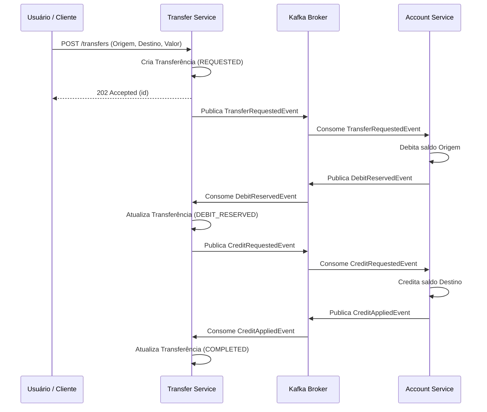
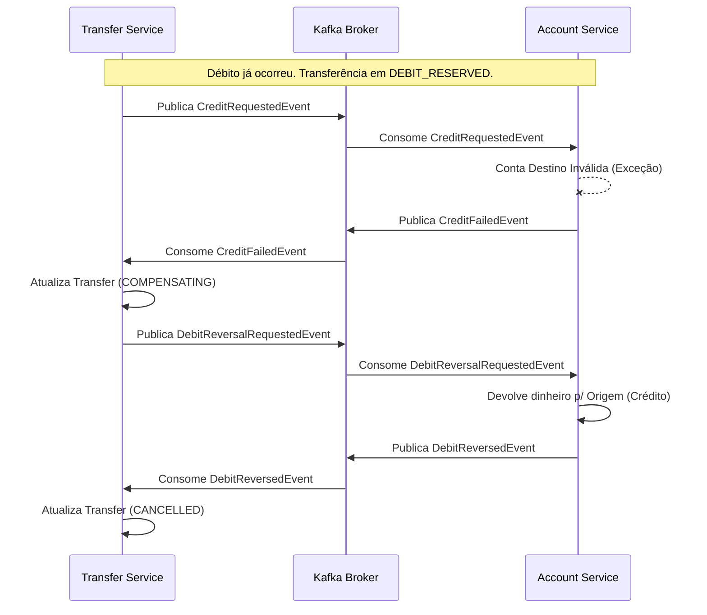

# Bank Transfer System — Documento de Arquitetura

Este documento detalha o funcionamento, as garantias e os fluxos do sistema bancário de transferências. O ecossistema é formado por dois microsserviços autônomos construídos sob a óptica de **Arquitetura Hexagonal** (Ports and Adapters) e orquestrados por **Sagas Coreografadas** via Kafka.

---

## 1. Visão Geral dos Microsserviços

O sistema divide as responsabilidades financeiras de forma clara para que nenhum serviço conheça o banco de dados do outro. A comunicação entre eles é 100% assíncrona baseada em eventos (Event-Driven Architecture).

- **`account-service`**: O dono verdadeiro do dinheiro. Ele gerencia as contas (`Account`) e os saldos. Ele não sabe o que é uma "transferência", limitando-se a executar operações atômicas de débito (`ReserveDebit`), crédito (`ApplyCredit`) e estorno (`ReverseDebit`).
- **`transfer-service`**: O coordenador de processo. Ele não guarda dinheiro, mas simula uma "máquina de estados" de uma transferência (`Transfer`). Ele comanda o account-service através de eventos e reage ao sucesso ou à falha de cada passo da saga.

---

## 2. A Saga de Transferência (Fluxos e Diagramas)

A transferência distribuída é tratada como uma **Saga**. Abaixo os fluxos de sucesso e de compensação (rollback).

### O Caminho Feliz (Sucesso)
Quando a conta destino existe e o saldo da conta origem é suficiente:

### O Caminho de Falha e Compensação (Caminho Triste)
Se a conta origem não tem saldo, o débito falha imediatamente (`DebitFailed`), e a transferência é `CANCELLED`.
Mas o cenário mais complexo é: o débito funciona, **mas o crédito falha** (conta destino inativa ou inexistente). Nesse momento, o dinheiro da origem está bloqueado, precisando ser devolvido.

> [!CAUTION]
> Enquanto a reversão de débito não for confirmada (`DebitReversedEvent`), o `transfer-service` não deve assumir que o processo foi cancelado. É por isso que existe o status temporário `COMPENSATING`.

---

## 3. Arquitetura Hexagonal (Limpa)
O código fonte não mistura regras de negócios com persistência ou mensageria.
- **Camada de Domínio (`domain`)**: Pura, contém `Account` e `Transfer`. Exceções de negócio (`InsufficientBalanceException`) e interfaces (`ports`) de entrada (UseCases) e saída (Repositories). Nenhuma anotação `@Entity` ou `@Component` vive aqui.
- **Camada de Aplicação (`application`)**: Orquestra os objetos de domínio. Mantém transações do banco, cuida da idempotência e despacha os eventos para a porta de saída.
- **Camada de Adaptadores (`adapter`)**: Todo o código "sujo" reside aqui. Controllers HTTP, listeners do Kafka, repositórios do Spring Data JPA. Eles traduzem o mundo externo para a linguagem de domínio.

---

## 4. Garantias e Resiliência "Nível Bancário"

O sistema implementa diversos padrões para não perder dinheiro durante a eventual falha da infraestrutura.

### Idempotência
A idempotência garante que uma mesma mensagem do Kafka processada 2 vezes não credite ou debite a conta duas vezes. 
- No **`transfer-service`**: Guardas de transição de estado. Ex: se ele recebe um `CreditApplied` e a transferência já está como `COMPLETED`, ele ignora.
- No **`account-service`**: Usa-se a tabela `processed_events`. Toda mensagem processada registra sua `idempotencyKey`. O Kafka só envia a confirmação (`ack`) depois que o registro de banco é "commitado".

### Outbox Pattern (Apenas no account-service)
Para evitar o problema de *Two-Phase Commit (2PC)*, onde o banco confirma mas a rede do Kafka cai (evento fantasma):
- Ao invés de usar `kafkaTemplate.send()` diretamente no serviço, os eventos são persistidos em uma tabela relacional (`outbox_events`) em **mesma transação** do saldo da conta.
- Uma rotina via `@Scheduled` capta eventos onde `published = false` e injeta no Kafka com tranquilidade.

### Event Sourcing e Optimistic Locking
- **Locking Otimista (`@Version`)**: O JPA controla edições simultâneas (concorrência) utilizando versões numéricas. Se 2 saques simultâneos tentarem afetar a mesma conta, um falhará e poderá tentar novamente.
- **Event Sourcing**: A tabela `account_events` se comporta como um log contador (Ledger financeiro). Toda alteração gera um insert imutável no banco, criando trilha para auditorias independentes do estado final de `Account`.

### Dead Letter Queue (DLQ)
Mensagens corrompidas ou falhas não catalogadas repetem um número *N* de vezes. Se falharem consecutivamente, o `DeadLetterPublishingRecoverer` envia para um tópico finalizado em `.DLT`. A API REST `DlqController` disponibilizada permite drenagem manual de mensagens problemáticas.
